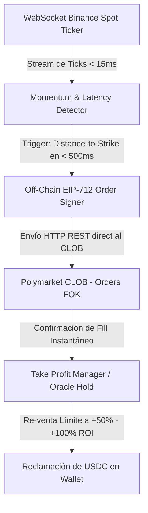

# ARQUITECTURA MAESTRA Y ROADMAP: ULTRA-FAST LATENCY SNIPER BOT (CRIPTOBOT v2.0)

**Proyecto:** Criptobot Ultra-Fast HFT Engine  
**Versión:** 2.0 (Especificación de Producción Definitiva)  
**Autor:** Antigravity AI & Anton  
**Estado:** Listo para Desarrollo  
**Inspiración & Base Técnica:** `PROPUESTA_BOT_FRANCOTIRADOR_HFT.md`  
**Capital Inicial:** $13.00 USDC (Flujo de Caja Reciclable Horario)  

---

## 1. Arquitectura Ultra-Rápida de Ultra-Baja Latencia (<15ms)

Para garantizar la máxima velocidad de ejecución y superar el tiempo de reacción del mercado, Criptobot v2.0 implementa el motor de ultra-baja latencia diseñado en `PROPUESTA_BOT_FRANCOTIRADOR_HFT.md`:



### Componentes de Ultra-Velocidad:
1. **`BinanceStreamEngine.ts`**: Conexión WebSocket persistente de latencia cero (`wss://stream.binance.com:9443/ws/<pair>@trade`). Procesa los cambios de precio en Binance Spot en menos de **15 milisegundos**.
2. **`MomentumDetector.ts`**: Evalúa el delta de precio respecto a la apertura del ciclo (`Distance-to-Strike`) en ventanas de **500 milisegundos**, sin bloqueo de hilos.
3. **`ClobSniperEngine.ts`**: 
   * Firma órdenes fuera de cadena (Off-Chain Layer 2) mediante la especificación **EIP-712** utilizando `@polymarket/clob-client`.
   * **Cero llamadas RPC pesadas a Polygon en la ruta crítica del disparo**: la orden se envía en milisegundos como un payload JSON pre-firmado directamente al servidor CLOB de Polymarket.
   * Utiliza únicamente órdenes límite **Fill-Or-Kill (FOK)**.
4. **`TakeProfitManager.ts`**: En cuanto la orden de compra es confirmada, coloca automáticamente una orden límite de re-venta en el libro para asegurar ganancias en minutos (+50% a +100% ROI) sin esperar al settlement.

---

## 2. Reglas de Hierro y Garantía Anti-Errores (Cero Hardcodeo)

| Componente | Regla de Hierro | Implementación Técnica |
| :--- | :--- | :--- |
| **Dashboard** | **100% Datos en Vivo de la API/Blockchain (Cero Valores MOCK/Hardcodeados)** | Conexión directa a `clobClient.getCollateralBalance()`, `clobClient.getOpenOrders()` y Polygon RPC para mostrar: <br>1. **Saldo Total en Wallet** <br>2. **Saldo Disponible Libre para Operar** <br>3. **Posiciones Activas Abiertas** <br>4. **Historial de Resoluciones** |
| **Órdenes** | **Únicamente Órdenes Límite FOK (Fill-Or-Kill)** | Cero órdenes a mercado. Si no está la liquidez exacta a $2.00 USD al precio límite deseado, la orden se rechaza automáticamente a nivel de protocolo sin gastar nada. |
| **Decisiones** | **Cero dependencia de la BD local para operar** | La BD SQLite es un log administrativo pasivo fuera del hilo principal. El motor toma decisiones leyendo en tiempo real el WebSocket de Binance Spot y la API de Polymarket. |
| **Gestión Washybot** | **Modo RESOLVE_ONLY (Congelación de Nuevas Posiciones)** | Washybot entra en modo pasivo de liquidación: no abre nuevas posiciones y únicamente gestiona el cobro u oráculo de las posiciones existentes para proteger los $13.00 USDC. |

---

## 3. Matriz Operativa por Moneda (XRP, SOL, DOGE)

### 🔹 Moneda 1: XRP (Francotirador Scalper Ultra-Rápido)
* **Ventana Temporal**: **Minutos 15 a 28** del ciclo de 1 Hora.
* **Rango de Cuota Entrada**: **$0.31 a $0.42** (Descuento del 58% al 69%).
* **Condición Binance Spot**: `Distance-to-Strike > +0.05%` respecto a la apertura 00:00.
* **Gestión de Salida**: Re-venta inmediata en el libro con Limit Sell a **$0.65 - $0.85** (+50% a +100% ROI rápido) impulsado por `TakeProfitManager.ts`.

### 🟣 Moneda 2: SOLANA (Cobertura Asimétrica 75% / 25%)
* **Ventana Temporal**: **Minutos 33 a 43** del ciclo de 1 Hora.
* **Capital por Ciclo**: **$2.66 USDC total** por ciclo de Solana.
  * **Bala 1 (Lado Dominante - 75%)**: **$2.00 USDC** al lado con tendencia en Binance Spot (ej. UP a $0.40).
  * **Bala 2 (Seguro Desfavorecido - 25%)**: **$0.66 USDC** al lado opuesto a precio super descuento ($0.15 - $0.25).
* **Gestión de Salida**: 100% Hold to Oracle ($1.00 USD settlement).

### 🟡 Moneda 3: DOGECOIN (Cazador Tardío de 1 Minuto)
* **Ventana Temporal**: **Minutos 33 a 58** del ciclo de 1 Hora (Libros desiertos en la primera media hora).
* **Rango de Cuota Entrada**: **$0.20 a $0.35** (En la segunda mitad del ciclo).
* **Condición Binance Spot**: Desviación acumulada limpia en Binance Spot.
* **Gestión de Salida**: Hold to Oracle ($1.00 USD).

---

## 4. Modelo Financiero: Reciclaje de Capital Horario y Compuesto

Dado que los mercados de 1 Hora resuelven al finalizar cada hora (10:00, 11:00, 12:00, etc.):
* **Inyección Inmediata**: Al cerrar la hora, el Smart Contract de Polymarket liquida la posición ganadora e inyecta el dinero de vuelta al wallet en tiempo real.
* **Reutilización de las 6 Balas**: Los $13.00 USDC se reciclan hora tras hora, permitiendo realizar entre **15 y 24 operaciones diarias**.
* **Escalamiento Automático**: A medida que el saldo en el wallet crezca de $13 a $25, $50 y $100+ USDC, el bot escalará el tamaño de la bala de $2.00 USD a $5.00 USD de forma automática.

---

## 5. Web Dashboard en Tiempo Real (API Driven)

El Dashboard en tiempo real utilizará **Express + WebSockets + Vanilla CSS**, leyendo datos directos de la API oficial sin mocks:

```
+-----------------------------------------------------------------------------------+
| CRIPTOBOT v2.0 - LIVE CONTROL DASHBOARD | [MODO: LIVE / SHADOW]                   |
+-----------------------------------------------------------------------------------+
| SALDO TOTAL WALLET: $13.00 USDC | DISPONIBLE LIBRE: $13.00 USDC | EN ÓRDENES: $0.00 |
+-----------------------------------------------------------------------------------+
| TICKERS EN VIVO (BINANCE SPOT vs POLYMARKET 1H)                                   |
| - XRPUSDT:  $1.0220 | Open: $1.0210 | Delta: +0.10% | Poly UP: $0.35 | Sello: 🎯 UP|
| - SOLUSDT:  $73.85  | Open: $73.72  | Delta: +0.18% | Poly UP: $0.23 | Sello: 🎯 UP|
| - DOGEUSDT: $0.0697 | Open: $0.0697 | Delta:  0.00% | Poly UP: $0.50 | Sello: ⏸️ WAIT|
+-----------------------------------------------------------------------------------+
| POSICIONES REALES EN WALLET (LIVE CLOB API)                                       |
| [2026-08-08 00:28] XRP 1H UP | Qty: 5.71 | Price: $0.35 | Invertido: $2.00 | Status: OPEN |
+-----------------------------------------------------------------------------------+
```
