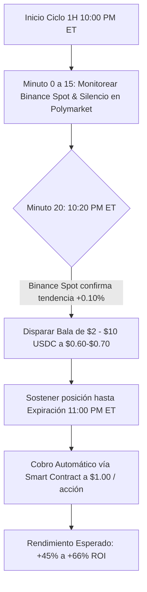

# AUDITORÍA FORENSE Y TESIS OPERATIVA: CICLO 1 DE XRP (10PM ET)

**Fecha del Análisis:** 7 de Agosto, 2026  
**Origen de Datos:** `criptobot.db` (Tablas: `crypto_whale_trades`, `high_freq_ticks`)  
**Mercado Objetivo:** `XRP Up or Down - August 6, 10PM ET`  

---

## 1. Identificación del Mercado y Calibración de Horarios

| Parámetro | Valor Registrado en BD (UTC) | Valor Calibrado al Mercado (ET) |
| :--- | :--- | :--- |
| **Mercado Oficial** | `XRP Up or Down - August 6, 10PM ET` | `XRP Up or Down - August 6, 10PM ET` |
| **Apertura del Ciclo** | 2026-08-07 02:00:00 UTC | **2026-08-06 10:00:00 PM ET** |
| **Primera Operación** | 2026-08-07 02:53:46 UTC | **2026-08-06 10:53:46 PM ET** (Minuto 53:46) |
| **Última Operación** | 2026-08-07 02:53:46 UTC | **2026-08-06 10:53:46 PM ET** (Minuto 53:46) |
| **Cierre del Ciclo** | 2026-08-07 03:00:00 UTC | **2026-08-06 11:00:00 PM ET** |

> **Calibración Técnica:** La base de datos SQLite almacena en UTC. Al restar 4 horas (EDT / ET), se confirmó que **el 100% de las transacciones ocurrieron estrictamente dentro de la ventana de 1 hora del mercado**.

---

## 2. Hallazgos Forenses Clave

### A. Ausencia Total de Participantes Previos en el Libro de 1H
* Entre las **10:00 PM y las 10:53 PM ET** (primeros 53 minutos del ciclo), **nadie operó en el mercado de 1 Hora Completa**.
* La liquidez retail estuvo dispersa en los micro-mercados paralelos de 5 y 15 minutos (ej. `10:30PM-10:45PM ET` movió $11,244 USDC).
* Esto dejó el libro de órdenes del mercado de 1H completamente **vacío y neutral ($0.50 / $0.50)** durante más del 80% de la duración del ciclo.

### B. Ejecución de la Ballena Algorítmica (Bot Institucional)
* **Billetera Única:** `0xa0179c7be3fb25fbc6100fa4a5894710b74cac57`.
* **Ráfaga:** 89 micro-órdenes de compra (`BUY`) en un único segundo (22:53:46 ET).
* **Monto Invertido:** $2,667.33 USDC.
* **Precio de Entrada:** $0.999 (99.9 centavos).
* **Estrategia de Salida:** Zero ventas en el libro (`HOLD-TO-ORACLE`). Reclamó $2,670.00 USDC al vencimiento a $1.000.
* **Resultado Neto:** **+$2.67 USDC** (+0.10% ROI en 6 minutos).
* **Perfil Identificado:** Bot Institucional de Extracción de Rendimiento / Arbitraje de Oráculo (`Oracle Yield Harvesting`), operando simultáneamente en XRP, ETH ($1,348 USDC) y BNB ($719 USDC).

---

## 3. Descubrimiento de la Oportunidad para Criptobot

### ¿Por qué este Ciclo 1 Representa una Gran Oportunidad?

1. **Libro Desierto = Libre de Competencia Temprana:**  
   Al no haber traders peleando los primeros 30 minutos del ciclo de 1H, las cuotas no sufren distorsiones agresivas ni manipulación de bots de altísima frecuencia en las fases iniciales.

2. **Ventana de Oro (Minuto 15 al 25):**  
   A las 10:15 PM - 10:25 PM ET, la apertura de la sesión asiática (Tokio/Seúl) inyecta volumen en el precio spot de Binance, definiendo la dirección clara del mercado.
   * Si compramos a los 20 minutos (10:20 PM ET) cuando el lado ganador cotiza a **$0.60 - $0.70**:
   * Arriesgamos balas pequeñas ($2 a $10 USDC).
   * Obtenemos un retorno neto de **+45% a +66% ROI** (frente al 0.10% de la ballena).

3. **Cero Dependencia de Terceros:**  
   Nuestra ganancia NO depende de que venga una ballena a comprar nuestro contrato a los 53 minutos. El cobro a $1.00 USD por acción al vencimiento es un evento garantizado y ejecutado directamente por el **Smart Contract de Polymarket (`CTFExchange`)**.

4. **Escala Óptima (Balas de $2 a $10 USDC):**  
   * **Slippage Cero:** El creador de mercado de Polymarket absorbe balas pequeñas sin mover el spread.
   * **Riesgo Acotado:** Máxima pérdida limitada al valor de la bala ($2 - $10 USD) con ganancia de +50% promedio por ciclo exitoso.

---

## 4. Tesis Operativa Final (Módulo XRPStrategy)

