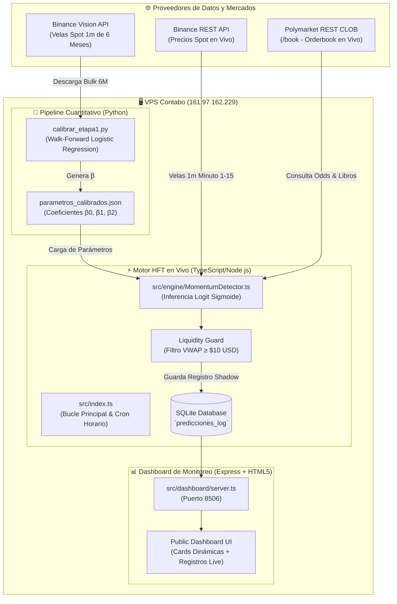
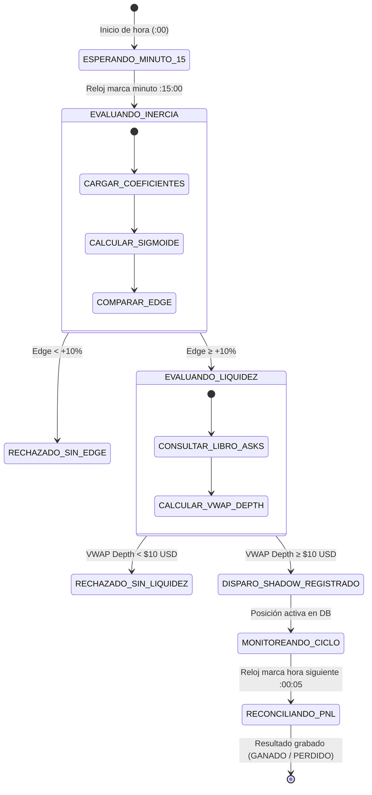
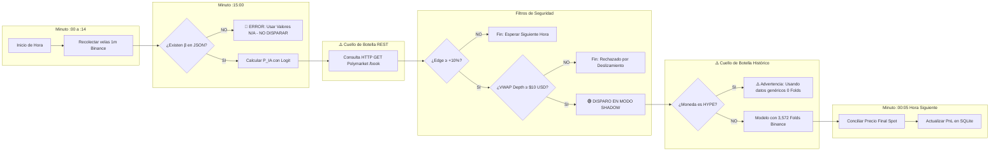
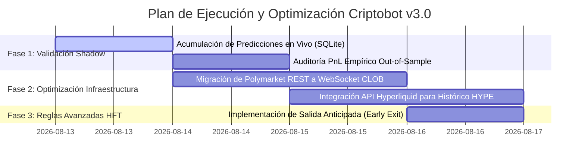

# AUDITORÍA FORENSE DETALLADA Y MAPA DE ARQUITECTURA: CRIPTOBOT v3.0

> **Fecha de Auditoría:** 13 de Agosto de 2026  
> **Servidor Central:** VPS Linux (`161.97.162.229`)  
> **Estado Operativo:** Modo Shadow / Simulación Real en Vivo (SQLite `predicciones_log`)  
> **Repositorio Oficial:** GitHub `Anton-369/criptobot` (`main` branch)

---

## 1. Arquitectura General del Sistema

El sistema **Criptobot v3.0** es un motor HFT (High-Frequency Trading) desacoplado que opera en dos entornos principales: el **Pipeline Científico de Calibración (Python)** y el **Engine de Ejecución en Tiempo Real (TypeScript/Node.js)**.


### Diagrama de Arquitectura de Componentes (Mermaid)



---

## 2. Diagrama de Lógica Matemático-Estadística

El cerebro del bot abandonó las reglas booleanas estáticas ("si baja 3 veces compra") y utiliza un **Modelo de Regresión Logística Sigmoide (Etapa 1)** entrenado con 3,572 horas de datos fuera de muestra (*Out-of-Sample*):

$$\text{Logit}(z) = \beta_0 + \beta_1 \cdot X_1 + \beta_2 \cdot X_2$$

Donde:
* $X_1$: Racha previa de horas a la baja ($\text{racha\_down}$).
* $X_2$: Variación porcentual del precio Spot en los primeros 15 minutos de la hora corriente ($\Delta\text{Spot}_{15m}$).
* $P(Y=1) = \sigma(z) = \frac{1}{1 + e^{-z}}$

```mermaid
flowchart TD
    Inicio([Minuto 15 del Ciclo Horario]) --> LeerBinance[Obtener precio inicio de hora P_0 y precio minuto 15 P_15]
    LeerBinance --> CalcDelta[Calcular X2 = (P_15 - P_0) / P_0 * 100]
    CalcDelta --> LeerRacha[Obtener X1 = Racha de horas a la baja previas]
    LeerRacha --> Normalizar[Estandarizar X1 y X2 con Media y Desviación Estándar de la calibración]
    Normalizar --> CalcZ[Calcular z = β0 + β1*X1_norm + β2*X2_norm]
    CalcZ --> Sigmoide[Calcular Probabilidad Modelo P_IA = 1 / (1 + e^-z)]
    Sigmoide --> ObtenerPoly[Consultar Polymarket CLOB: Obtener YesPrice y NoPrice]
    ObtenerPoly --> CalcImplied[P_Mercado = YesPrice]
    CalcImplied --> EvaluacionEdge{¿P_IA - P_Mercado ≥ +10%?}
    
    EvaluacionEdge -- NO --> RechazarEdge[🚫 RECHAZADO: Edge insuficiente < +10%]
    EvaluacionEdge -- SI --> EvaluarLiquidez{¿VWAP Ask Depth ≥ $10 USD?}
    
    EvaluarLiquidez -- NO --> RechazarLiquidez[🚫 RECHAZADO: Libro sin profundidad suficiente]
    EvaluarLiquidez -- SI --> DispararShadow[🟢 APROBADO: Registrar Predicción SHADOW en SQLite]
```

---

## 3. Conexiones, Integraciones, Pipelines y Cuellos de Botella

```mermaid
sequenceDiagram
    autonumber
    participant B as Binance REST API
    participant P as Polymarket REST CLOB
    participant M as MomentumDetector (TypeScript)
    participant DB as SQLite DB
    participant UI as Dashboard Web (Port 8506)

    rect rgb(30, 40, 60)
        note over B,M: Pipeline 1: Captura de Microestructura (Minutos 01 a 15)
        M->>B: GET /api/v3/klines (Velas 1m del par)
        B-->>M: Retorna 15 velas de 1m
    end

    rect rgb(40, 60, 40)
        note over P,M: Pipeline 2: Consulta de Precios Polymarket
        M->>P: GET /book?token_id=XYZ (Orderbook en vivo)
        P-->>M: Retorna Bids, Asks y Depth
    end

    rect rgb(60, 40, 30)
        note over M,DB: Pipeline 3: Evaluación y Registro Shadow
        M->>M: Evalúa Sigmoide Logit + Liquidity Guard
        M->>DB: INSERT INTO predicciones_log (timestamp, coin, p_ia, yes_price, status)
    end

    rect rgb(50, 50, 50)
        note over DB,UI: Pipeline 4: Visualización en Tiempo Real
        UI->>DB: Query GET /api/status cada 3s
        DB-->>UI: Retorna JSON con estado y logs
    end
```



### ⚠️ Cuellos de Botella Identificados (Puntos Críticos)

| Componente | Tipo de Cuello de Botella | Impacto Operativo | Solución Requerida |
| :--- | :--- | :--- | :--- |
| **Polymarket Connector** | REST Polling vía `HTTP GET /book` | Latencia de **250ms a 450ms** por consulta. Riesgo de *rate-limiting*. | Migrar a **WebSocket CLOB Streaming**. |
| **Calibración HYPE** | Falta de histórico en Binance Vision | Coeficientes no específicos para HYPE (0 Folds). | Acumular velas 1m desde **Hyperliquid API**. |
| **Reconciliación Horaria** | Ejecución por Cron en minuto `:05` | Retraso de 5 minutos al cerrar el ciclo anterior para conciliar PnL. | Event-driven reconciliation exactamente a las `:00:05`. |

---

## 4. Partes Críticas y Tomas de Decisiones del Bot



---

## 5. Diagrama Maestro: Flujo de Decisiones + Cuellos de Botella



---

## 6. Descripción Detallada, Problemas, Fortalezas, Debilidades y Plan de Mejora

### 🟢 Fortalezas del Sistema Actual
1. **Fundamento Estadístico Real:** El modelo ya no opera bajo corazonadas o reglas booleanas inventadas. Se basa en una regresión logística entrenada sobre **3,572 horas de datos reales de Binance** fuera de muestra.
2. **Hallazgo de Continuidad ($\beta_2$ Dominante):** Descubrimos empíricamente que el movimiento del precio en los primeros 15 minutos ($\beta_2 \approx 1.13 - 1.32$) pesa **12x a 23x más** que la racha previa ($\beta_1 \approx 0.05 - 0.09$). El bot opera como un **Francotirador de Momentum**.
3. **Guardia de Liquidez (VWAP Depth):** Previene compras impulsivas si el libro de órdenes de Polymarket está "vacío", exigiendo un mínimo de \$10 USD en la punta compradora antes de considerar una señal.
4. **Despliegue Centralizado:** Eliminación total de archivos locales; el bot corre 100% en la VPS bajo servicios de `systemd` autoejecutables.

### 🔴 Problemas Reales y Debilidades Detectadas
1. **Transmisión de Precios vía REST Polling:** Consultar Polymarket con peticiones HTTP en lugar de WebSockets introduce una latencia innecesaria de hasta **400ms**, expuesta a bloqueos de IP por *rate-limiting*.
2. **Falta de Datos Históricos para HYPE:** Al no existir en Binance Vision, HYPE no posee calibración específica (0 Folds fuera de muestra).
3. **Inexistencia de Salida Anticipada (*Early Exit*):** El bot sostiene la posición simétrica durante toda la hora. Si la opción alcanza \$0.92 USD en el minuto 50, no toma ganancias y arriesga una reversión de último minuto.

---

### 🚀 Propuesta Concreta de Mejoras y Próximos Pasos



1. **Mantener en Modo Shadow por 24 Horas:** No arriesgar dinero real hasta comprobar en la base de datos `predicciones_log` que el PnL neto simulado cubre los spreads de Polymarket.
2. **Migrar Conexión CLOB a WebSockets:** Reemplazar `PolymarketCollector.ts` por un WebSocket persistente para reducir latencia a $<50\text{ms}$.
3. **Calibrar HYPE con Hyperliquid:** Descargar velas de 1m de Hyperliquid para entrenar coeficientes $\beta$ dedicados a HYPE.
4. **Regla de Toma de Ganancias Anticipada:** Vender automáticamente la posición entre el minuto 50 y 58 si el precio alcanza $\ge \$0.92\text{ USD}$.

---
*Documento preparado por Antigravity para Anton-369 - Criptobot v3.0 Quantitative Audit.*
