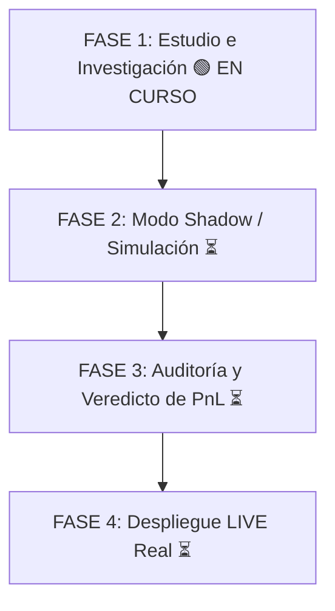

# 🚀 CRIPTOBOT - Documento Estratégico y de Arquitectura (Fase 1: Estudio)

> **Fecha de Actualización:** 6 de Agosto, 2026  
> **Repositorio GitHub:** [Anton-369/criptobot](https://github.com/Anton-369/criptobot)  
> **Estado:** 🟢 FASE 1: ESTUDIO E INVESTIGACIÓN (Riesgo $0.00 USD)

---

## 🎯 1. Objetivo General del Proyecto

Desarrollar un sistema de trading algorítmico autónomo en la VPS para los mercados de predicción cripto de Polymarket, manteniendo **absoluto aislamiento técnico y operativo** respecto al bot de clima (`washybot`).

* **Enfoque Temporal:** Ventanas de **1h, 4h y Diarios** (BTC, ETH, SOL, XRP, DOGE, BNB).
* **Descarte Técnico:** Se descartan los mercados de 5m y 15m por comisiones dinámicas (*Dynamic Taker Fees*) y competencia feroz de bots HFT.

---

## 🗺️ 2. Hoja de Ruta Metodológica (Las 4 Fases)

1. **FASE 1: Estudio e Investigación (EN CURSO 🟢):**
   * Recopilación continua de datos en VPS mediante 3 demonios 24/7.
   * Sin arriesgar capital. Medición de anomalías, descalces de precio y comportamiento de ballenas.
2. **FASE 2: Modo Shadow / Simulación (Siguiente Paso ⏳):**
   * Motor de ejecución simulada con capital ficticio ($2.00 USDC por bala).
   * Verificación en tiempo real de entradas y salidas virtuales.
3. **FASE 3: Auditoría de Resultados (⏳):**
   * Análisis de Win Rate (> 60%) y Profit Factor (> 1.5) sobre 50–100 trades simulados.
4. **FASE 4: Paso a LIVE (⏳):**
   * Activación con capital real en la cartera secundaria.

---

## ⚙️ 3. Infraestructura Desplegada en la VPS (100% Autónoma)

Todos los servicios operan bajo `systemd` a nivel de usuario en la VPS y están activos 24/7:

| Servicio Systemd | Archivo Python | Frecuencia / Función | Estado |
| :--- | :--- | :--- | :--- |
| `criptobot-ticks.service` | `src/high_freq_tick_collector.py` | **Cada 5 Segundos**: Guarda fotogramas de Binance Spot vs Polymarket y detecta saltos > 5%. | 🟢 **ACTIVE (running)** |
| `criptobot-radar.service` | `src/crypto_radar_daemon.py` | **Cada 3 Segundos**: Captura trades y wallets activas en mercados 1h, 4h y Diarios. | 🟢 **ACTIVE (running)** |
| `criptobot-lag.service` | `src/binance_lag_scanner.py` | **Cada 10 Segundos**: Detecta descalces implícitos entre Binance Spot y cuotas Polymarket. | 🟢 **ACTIVE (running)** |
| `criptobot-dashboard.service` | `src/cripto_dashboard.py` | **Tiempo Real (Puerto 8504)**: Dashboard visual interactivo en Streamlit. | 🟢 **ACTIVE (running)** |

---

## 📊 4. Accesos a los Dashboards en VPS

* ⚡ **Dashboard Criptobot (Puerto 8504):**
  * Local (misma PC): [http://localhost:8504](http://localhost:8504)
  * Red Local / Celular (Wi-Fi): [http://192.168.100.15:8504](http://192.168.100.15:8504)
* 🌤️ **Dashboard Washybot Clima (Puerto 8503 - Intacto):**
  * Local: [http://localhost:8503](http://localhost:8503)
  * Red Local: [http://192.168.100.15:8503](http://192.168.100.15:8503)

---

## 🔬 5. Metodología de Análisis de Datos (Puntos Clave)

1. **Fotogramas de 5 Segundos (Alta Frecuencia):**
   * En lugar de tomar promedios cada 2 minutos (donde una ráfaga de compras se perdería), el colector registra cambios cada 5s para capturar disparos instantáneos de cuotas y entender el desencadenante exacto.
2. **Análisis de Anomalías:**
   * La tabla `high_freq_ticks` marca automáticamente cualquier salto brusco (variación ≥ 5% en 5s), permitiendo reconstruir la secuencia exacta de precios antes, durante y después del evento.
3. **Filtro de Ballenas y Anomalías:**
   * Una vez detectadas las anomalías de precio/volumen, se realiza ingeniería inversa on-chain (vía PolygonScan/API) para evaluar si fue generado por una ballena solitaria o por comportamiento colectivo.

---

## 📌 6. Próximo Hito

Dejar correr los 3 colectores en la VPS durante las próximas **24–48 horas** para acumular una base de datos amplia de ticks y trades. Posteriormente, auditaremos los resultados en el Dashboard antes de definir las reglas de entrada del modo Shadow.
