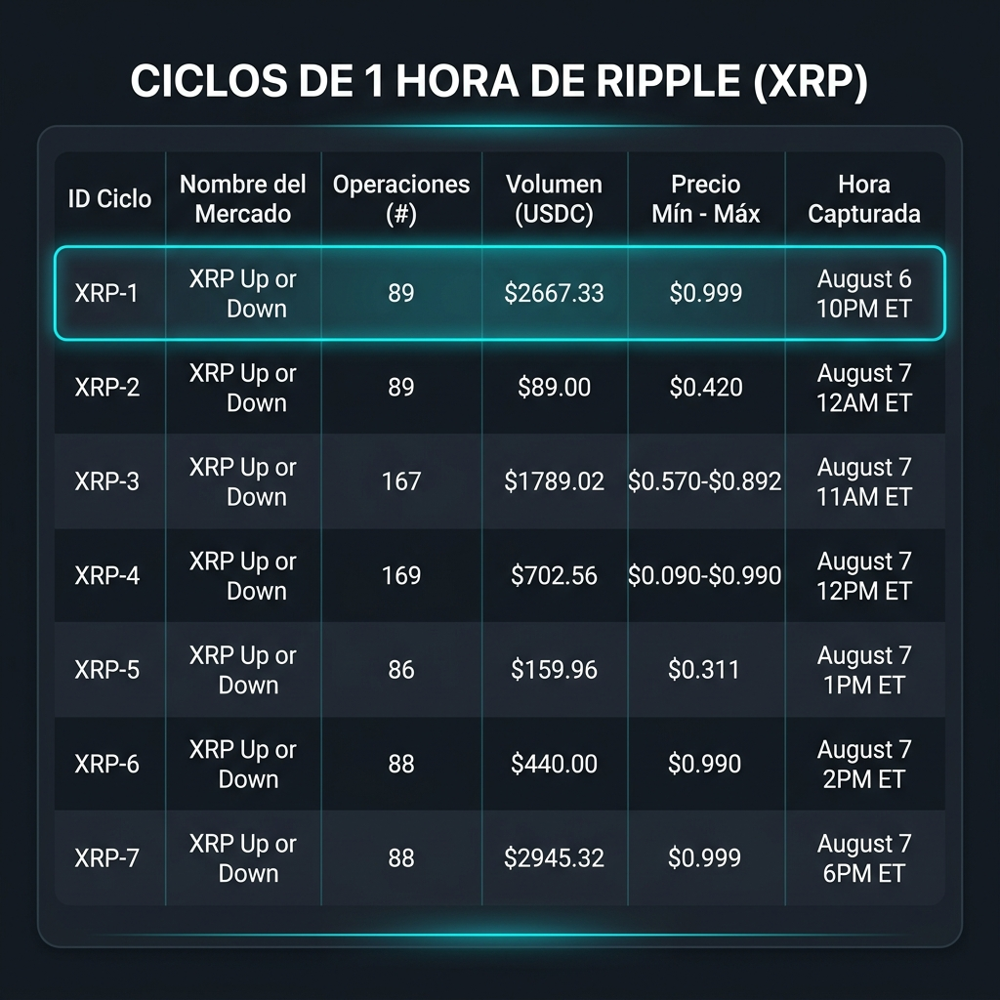
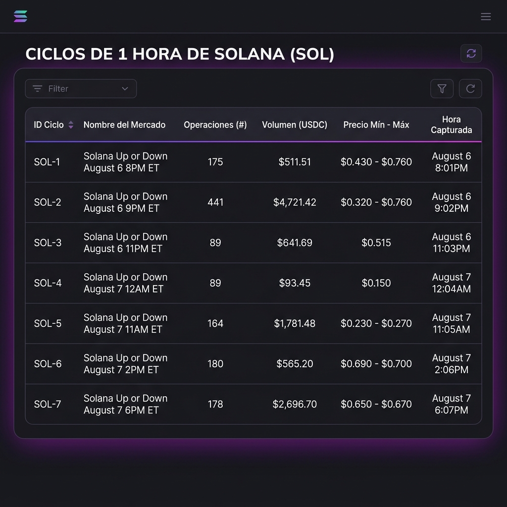

# 📊 Auditoría Forense: Ciclos de 1 Hora (Ripple XRP vs Solana SOL)

> **Origen**: Reconciliación Estricta de `criptobot.db`  
> **Fecha**: 7 de Agosto, 2026  
> **Estado**: Registro Visual Oficial de Ciclos de 1 Hora

---

## 🌐 1. Ciclos de 1 Hora de Ripple (XRP)

### Detalle de Datos:
| ID Ciclo | Nombre del Mercado | Operaciones (#) | Volumen (USDC) | Precio Mín - Máx | Rango de Tiempo Capturado |
| :---: | :--- | :---: | :---: | :---: | :--- |
| **XRP-1** | `XRP Up or Down - August 6, 10PM ET` | 89 | $2,667.33 | $0.999 | 10:53 PM ET |
| **XRP-2** | `XRP Up or Down - August 7, 12AM ET` | 89 | $89.00 | $0.420 | 12:28 AM ET (Medianoche) |
| **XRP-3** | `XRP Up or Down - August 7, 11AM ET` | 167 | $1,789.02 | $0.570 - $0.892 | 11:43 AM - 11:58 AM ET |
| **XRP-4** | `XRP Up or Down - August 7, 12PM ET` | 169 | $702.56 | $0.090 - $0.990 | 12:43 PM - 12:48 PM ET |
| **XRP-5** | `XRP Up or Down - August 7, 1PM ET` | 86 | $159.96 | $0.311 | 1:13 PM ET |
| **XRP-6** | `XRP Up or Down - August 7, 2PM ET` | 88 | $440.00 | $0.990 | 2:59 PM ET |
| **XRP-7** | `XRP Up or Down - August 7, 6PM ET` | 88 | $2,945.32 | $0.999 | 6:58 PM ET |

---

## 🟣 2. Ciclos de 1 Hora de Solana (SOL)

### Detalle de Datos:
| ID Ciclo | Nombre del Mercado | Operaciones (#) | Volumen (USDC) | Precio Mín - Máx | Rango de Tiempo Capturado |
| :---: | :--- | :---: | :---: | :---: | :--- |
| **SOL-1** | `Solana Up or Down - August 6, 8PM ET` | 175 | $511.51 | $0.430 - $0.760 | 8:33 PM - 8:53 PM ET |
| **SOL-2** | `Solana Up or Down - August 6, 9PM ET` | 441 | $4,721.42 | $0.320 - $0.760 | 9:03 PM - 9:53 PM ET |
| **SOL-3** | `Solana Up or Down - August 6, 11PM ET` | 89 | $641.69 | $0.515 | 11:43 PM ET |
| **SOL-4** | `Solana Up or Down - August 7, 12AM ET` | 89 | $93.45 | $0.150 | 12:33 AM ET (Medianoche) |
| **SOL-5** | `Solana Up or Down - August 7, 11AM ET` | 164 | $1,781.48 | $0.230 - $0.270 | 11:38 AM ET |
| **SOL-6** | `Solana Up or Down - August 7, 2PM ET` | 180 | $565.20 | $0.690 - $0.700 | 2:33 PM ET |
| **SOL-7** | `Solana Up or Down - August 7, 6PM ET` | 178 | $2,696.70 | $0.650 - $0.670 | 6:39 PM ET |

---
*Criptobot — Registros de Auditoría de Ciclos de 1 Hora*
