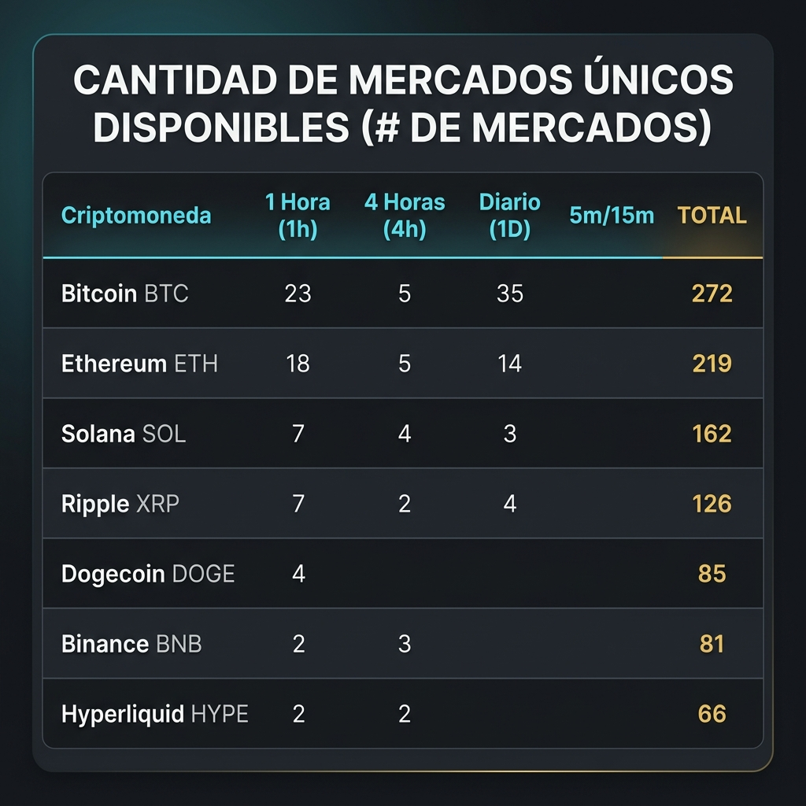

# 📊 Cantidad de Mercados Únicos Disponibles por Cripto y Temporalidad (#)

> **Origen**: Conteo Estricto de Mercados Únicos Registrados en `criptobot.db`  
> **Fecha**: 7 de Agosto, 2026  
> **Estado**: Documento Oficial de Disponibilidad de Mercados

---

---

## 📌 Tabla Completa de Disponibilidad (# de Mercados)

| Criptomoneda | 1 Hora (1h Completa) | 4 Horas (4h) | Diario (1 Día) | 5m / 15m (Ultracorto) | **TOTAL MERCADOS DISPONIBLES (#)** |
| :--- | :---: | :---: | :---: | :---: | :---: |
| 🥇 **Bitcoin (BTC)** | **23 mercados** | **5 mercados** | **35 mercados** | 209 mercados | **272 mercados disponibles** |
| 🥈 **Ethereum (ETH)** | **18 mercados** | **5 mercados** | **14 mercados** | 182 mercados | **219 mercados disponibles** |
| 🥉 **Solana (SOL)** | **7 mercados** | **4 mercados** | **3 mercados** | 148 mercados | **162 mercados disponibles** |
| 🌐 **Ripple (XRP)** | **7 mercados** | **2 mercados** | **4 mercados** | 113 mercados | **126 mercados disponibles** |
| 🐕 **Dogecoin (DOGE)** | **4 mercados** | 0 mercados | 0 mercados | 81 mercados | **85 mercados disponibles** |
| 🟡 **Binance (BNB)** | **2 mercados** | **3 mercados** | **2 mercados** | 74 mercados | **81 mercados disponibles** |
| 💧 **Hyperliquid (HYPE)** | **2 mercados** | **2 mercados** | 0 mercados | 62 mercados | **66 mercados disponibles** |
| 📦 **Otras Criptos** | 0 mercados | 0 mercados | **13 mercados** | 12 mercados | **25 mercados disponibles** |

---

## 📌 Conclusiones Clave de Oferta de Mercado

1. **Bitcoin (BTC)** encabeza la oferta con **58 mercados utilizables al día** (23 de 1h + 35 Diarios).
2. **Ethereum (ETH)** sigue en segundo lugar con **32 mercados utilizables al día** (18 de 1h + 14 Diarios).
3. **Hyperliquid (HYPE)** solo ofrece **4 mercados utilizables al día** (2 de 1h + 2 de 4h).
