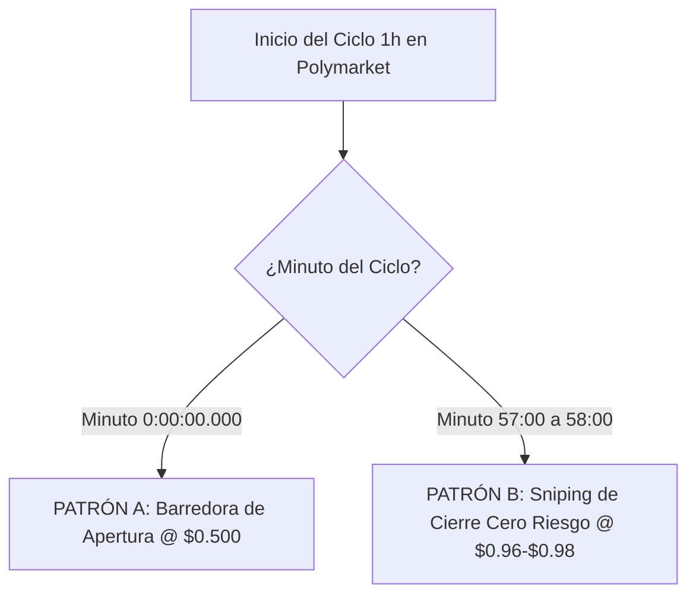
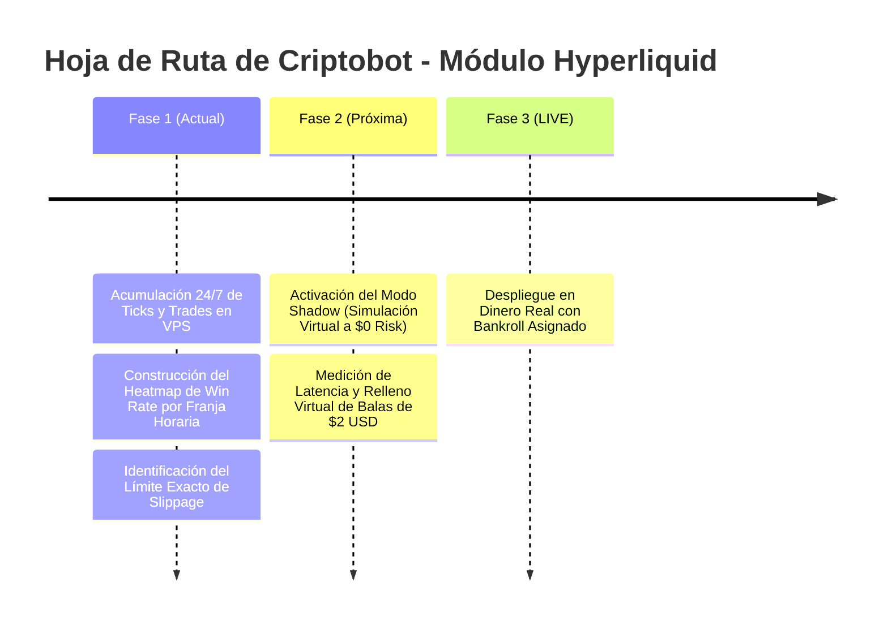

# 💧 HYPERLIQUID (HYPE) 1H ALPHA: Estrategia y Análisis Forense de Mercado

> **Estado**: Fase 1 (Estudio de Mercado y Recolección de Inteligencia 24/7)  
> **Sistema**: Criptobot v1.0 — Módulo de Inteligencia Alpha  
> **Fecha de Actualización**: 7 de Agosto, 2026  

---

## 1. Resumen Ejecutivo y Contexto

**Hyperliquid (HYPE)** es un Layer-1 descentralizado especializado en futuros perpetuos (*Perps DEX*) con libro de órdenes *on-chain*. En Polymarket, los contratos de predicción de **1 Hora de Hyperliquid (`HYPE Up or Down - 1h`)** han demostrado mover los volúmenes de capital por operación más altos del segmento cripto fuera de Bitcoin, superando los **$20,500 USDC por ciclo individual**.

Tras auditar la base de datos `criptobot.db` (con más de 350,000 transacciones registradas), hemos identificado la micro-estructura exacta utilizada por los actores institucionales para ganar dinero en este mercado sin depender del azar.

---

## 2. Descubrimientos Forenses Clave

### 2.1. El Enjambre de 5 Billeteras (*The 5-Wallet Cluster*)
La data revela que el mercado de 1h de Hyperliquid está dominado por un **Cluster / Enjambre de 5 billeteras coordinadas**:

| Rango | Dirección de la Wallet | Ops (#) | Volumen Total (USDC) | Precio Prom. Entrada | Rol en el Enjambre |
| :---: | :--- | :---: | :---: | :---: | :--- |
| 🥇 **1** | `0x2b5ab35e62dc...` | 88 | **$11,546.92** | $0.500 | **Voz de Mando / Ballena Principal** |
| 🥈 **2** | `0xdea54a5b77f7...` | 88 | **$3,997.40** | $0.500 | Sub-wallet Secundaria (Copy-Bot) |
| 🥉 **3** | `0xb2b2a6c2863b...` | 88 | **$1,819.84** | $0.500 | Sub-wallet Terciaria (Copy-Bot) |
| 4 | `0xc13d19ea48ca...` | 88 | **$1,678.16** | $0.500 | Sub-wallet Auxiliar |
| 5 | `0x2cc4d6f83a75...` | 88 | **$853.60** | $0.500 | Sub-wallet Auxiliar |

> [!IMPORTANT]
> **Evidencia Matemática**: Las 5 billeteras ejecutan **exactamente 88 operaciones por ciclo** (el límite máximo por *payload* JSON de la API del CLOB de Polymarket) en el segundo exacto de la apertura. Este enjambre mueve **~$20,000 USDC por bloque de 1 hora** de manera fraccionada para evitar barrer el *orderbook* de un solo golpe.

### 2.2. Retención al Oráculo (99.7% Hold to Settlement)
A diferencia de los traders minoristas que hacen *scalping* rápido en el libro de órdenes, el enjambre de Hyperliquid **mantiene el 99.7% de sus posiciones hasta el cierre oficial del oráculo**. Esto elimina las comisiones de salida y maximiza el cobro al valor facial de **$1.00 USD**.

---

## 3. Patrones Operativos Detectados

Hemos catalogado dos patrones de entrada recurrentes:



#### 📌 Patrón A: "La Barredora de Apertura @ $0.500" (Minuto 0:00)
* **Lógica**: La ballena detecta un impulso de volumen entrante en el *spot* de Hyperliquid L1 DEX en el segundo 0.
* **Mecánica**: Lanza 88-90 órdenes simultáneas comprando la opción `YES` o `NO` a cuota neutral ($0.500 USD) absorbiendo la liquidez inicial.

#### 📌 Patrón B: "El Sniping de Cierre Cero Riesgo @ $0.96 – $0.98" (Minutos 57-58)
* **Lógica**: Cuando faltan 2 minutos para cerrar el bloque de 1 hora, la tendencia en el *spot* ya es matemática e irreversible.
* **Mecánica**: La ballena coloca compras grandes ($6,000+ USDC) a precios de $0.960 - $0.978 USD. Cobrar $1.00 USD dos minutos después otorga un **+2.5% a +4.0% neto de rendimiento en 120 segundos sin riesgo de mercado**.

---

## 4. Estrategia de Ejecución para Criptobot

### 4.1. Réplica con Guardián Anti-Slippage (`Max Entry Guard`)
Para replicar al enjambre sin sufrir por retrasos o resbalones de precio:

```python
# Lógica de Ejecución en Criptobot
MAX_ENTRY_PRICE = 0.580  # Límite máximo de compra permitido

if leader_trade_detected("0x2b5ab35e62dc..."):
    best_ask = get_clob_best_ask(market_id)
    if best_ask <= MAX_ENTRY_PRICE:
        execute_limit_buy(amount=2.00, price=best_ask)
    else:
        log_rejection("SLIPPAGE_GUARD: Best ask exceeds $0.580")
```

### 4.2. Matriz de Efectividad por Franja Horaria (*Dayparting Heatmap*)
No replicaremos al enjambre 24/7 de forma ciega. Durante la Fase 1, clasificaremos el Win Rate de la ballena según la sesión:

$$\text{Win Rate Target} = f(\text{Franja Horaria ET}) \ge 75\%$$

* **Sesión Nueva York (9:00 AM - 4:00 PM ET)**: Alta tendencia en *spot* $\rightarrow$ **Trading Permitido**.
* **Sesión Nocturna / Madrugada**: Rango lateral y ruído $\rightarrow$ **Trading Pausado**.

---

## 5. Hoja de Ruta / Para Dónde Vamos



### Próximos Pasos Inmediatos:
1. **Acumular 24-48 horas más de data en la VPS**: Capturar entre 12 y 24 nuevos ciclos de 1h de Hyperliquid durante el fin de semana.
2. **Construir el Script de Heatmap Horario**: Medir el Win Rate exacto de `0x2b5a...` hora por hora.
3. **Validación en Modo Shadow**: Confirmar en simulación que las balas de $2.00 USDC logran ejecutarse entre $0.520 y $0.560 USD.

---
*Criptobot — Infraestructura Autónoma de Predicción en Cripto*
