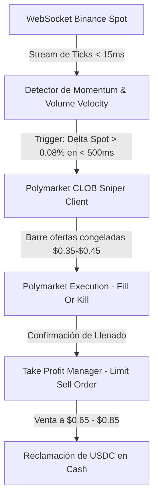

# ESPECIFICACIÓN TÉCNICA: MOTOR FRANCOTIRADOR DE LATENCIA (NIGHT SNIPER HFT)

**Proyecto:** Criptobot Framework  
**Fecha:** 7 de Agosto, 2026  
**Estado:** Propuesta Técnica de Implementación Futura  
**Inspiración Forense:** Wallet `0x32849aac9842aa19d28c530b0a8ee8a5a10a9be4` (Win Rate: 78.57%, ROI Promedio: +31.25%)  

---

## 1. Visión General del Sistema

El **Motor Francotirador HFT** es un sistema automatizado de micro-scalping impulsado por **arbitraje de latencia spot-to-CLOB**. Su objetivo es capturar ineficiencias temporales entre el precio real de Binance Spot y los libros de órdenes del CLOB de Polymarket en altcoins (XRP, SOL, ETH, BTC).

### Diferenciación Clave:
* **No adivina tendencias a largo plazo.**
* **Operación con Balas Pequeñas ($2 a $5 USDC):** Exposición al riesgo ultra-baja y cero impacto de mercado (slippage 0%).
* **Velocidad de In-Out:** Entradas y salidas completadas en ventanas de **12 a 60 segundos**.
* **Salida Dinámica:** Re-venta inmediata en el libro de órdenes al actualizarse las cuotas (+30% a +70% ROI) sin depender de sostener posiciones hasta la expiración del oráculo.

---

## 2. Arquitectura de Módulos (TypeScript / Node.js)

### Componentes Principales:

1. **`BinanceStreamEngine.ts`**:
   * Conexión WebSocket pura y persistente (`wss://stream.binance.com:9443/ws/<pair>@trade`).
   * Procesa cada transacción individual con latencia menor a 15-20 milisegundos.

2. **`MomentumDetector.ts`**:
   * Mide el *Cumulative Volume Delta (CVD)* y la aceleración del precio.
   * Dispara una señal de compra cuando el cambio spot supera el umbral parametrizado en una ventana de 500ms.

3. **`ClobSniperEngine.ts`**:
   * Integrado nativamente con `@polymarket/clob-client`.
   * Firma de mensajes EIP-712 fuera de cadena (L2) para lograr latencia de orden mínima.
   * Utiliza ordenes de tipo `FOK` (Fill-Or-Kill) o `IOC` (Immediate-Or-Cancel) a un precio desfasado objetivo ($0.35 - $0.45).

4. **`TakeProfitManager.ts`**:
   * En cuanto la orden de compra es confirmada en la API, coloca automáticamente una orden límite de venta a un target de retorno (+30% a +60% de ganancia).

---

## 3. Hoja de Ruta de Implementación (Roadmap)

### Fase 1: Motor de Simulación (Modo Shadow Latency)
- Conectar WebSocket de Binance y polling de libros de Polymarket para medir la latencia exacta de actualización en segundos.
- Loguear "disparos teóricos" y validar el Win Rate simulado sin arriesgar capital real.

### Fase 2: Ejecución de Prueba en Producción ($2 USD Balas)
- Conectar `@polymarket/clob-client` con la Proxy Wallet en LIVE mode.
- Cargar balas fijas de **$2.00 USDC**.
- Auditar y calibrar el `TakeProfitManager` en mercados de 5m, 15m y 1h de XRP y SOL.

### Fase 3: Escalamiento Proporcional
- Incrementar el tamaño de bala de forma progresiva ($5 USD a $10 USD máximos por trade) según el crecimiento de la banca.

---

## 4. Archivos Creados en el Repositorio
* `AUDITORIA_FORENSE_CICLO1_XRP.md` (Documentación del Ciclo 10PM ET)
* `PROPUESTA_BOT_FRANCOTIRADOR_HFT.md` (Especificación técnica del bot HFT)
