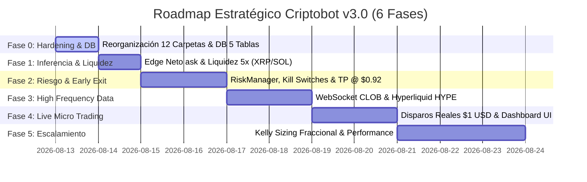

# 🗺️ ROADMAP DE EJECUCIÓN POR FASES: CRIPTOBOT v3.0

> **Basado al 100% en el Documento de Arquitectura y Mejoras (`Propuesta mejoras.md`)**  
> **Servidor:** VPS Linux (`161.97.162.229`) | **Entorno:** 100% Autónomo en VPS (Systemd + SQLite)

---

---

## 📌 FASE 0: Hardening Inmediato, Limpieza y Base de Datos (HOY)

* **Objetivo:** Erradicar todo parche viejo de la VPS, reestructurar la carpeta `src/` en 12 módulos limpios y migrar a la nueva base de datos relacional de 5 tablas.
* **Componentes a Implementar:**
  1. **Reorganización en 12 Módulos (`src/`):**
     * `config/`, `data/`, `features/`, `model/`, `risk/`, `execution/`, `reconciliation/`, `dashboard/`, `monitoring/`, `db/`.
  2. **Nueva Base de Datos SQLite (5 Tablas):**
     * `signals`: Registro matemático ($X_1, X_2, z, P_{\text{IA}}$, bids, asks, edge neto, motivo rechazo).
     * `orders`: Historial de órdenes enviadas a Polymarket.
     * `positions`: Posiciones abiertas, entradas, salidas y PnL.
     * `reconciliations`: Auditoría de resolución horaria.
     * `system_health`: Métricas de latencia y estado de servicios.
  3. **Validador de Datos (`src/data/dataValidator.ts`):** Comprobar que Binance tenga 15 velas 1m continuas y Polymarket mantenga cotizaciones activas.
  4. **Desactivar HYPE temporalmente:** Solo procesar XRP y SOL para disparos.
* **Entregable:** Código 100% limpio en la VPS, sin archivos parheados legados, compilando con `0 errors` en `npm run build`.

---

## 📌 FASE 1: Inferencia Matemática y Filtros Cuantitativos Reales

* **Objetivo:** Sustituir el cálculo de edge bruto por el verdadero **Edge Neto Ejecutable** sobre la punta vendedora real (`best_ask`) con filtro de liquidez profundo.
* **Componentes a Implementar:**
  1. **Cálculo de Edge Neto (`src/features/` & `src/risk/`):**
     $$\text{Edge Neto (YES)} = P_{\text{IA}} - \text{best\_ask\_yes} - \text{costosEstimados}\,(1.5\%)$$
     $$\text{Edge Neto (NO)} = (1 - P_{\text{IA}}) - \text{best\_ask\_no} - \text{costosEstimados}\,(1.5\%)$$
     *Filtro:* Disparar únicamente si $\text{Edge Neto} \ge +3\%$.
  2. **Filtro de Liquidez Ejecutable 5x (`src/risk/liquidityGuard.ts`):**
     * Profundidad en la punta Ask $\ge 5 \times \text{TamañoOrden}$ (mínimo $\$10\text{ USD}$ a $\$20\text{ USD}$).
     * Spread máximo Ask-Bid $\le 3.5\%$.
  3. **Timing de Binance a las `:15:01.500`:** Esperar 1.5s tras el cierre de minuto para garantizar la vela de 15m.
* **Entregable:** Inferencia matemática precisa de Edge Neto libre de distorsiones de spread.

---

## 📌 FASE 2: Motor de Riesgo (`RiskManager`), Kill Switches & Early Exit

* **Objetivo:** Proteger el capital en la VPS mediante un gestor de riesgo independiente y capturar ganancias anticipadas antes de la expiración de la hora.
* **Componentes a Implementar:**
  1. **Motor de Riesgo (`src/risk/riskManager.ts`):**
     * Límite de exposición máxima total ($\$50\text{ USD}$) y por moneda ($\$20\text{ USD}$).
     * Límite de pérdida diaria máxima ($\$15\text{ USD}$) y cooldown por pérdidas consecutivas.
  2. **Kill Switches (Manual & Automático):**
     * *Manual:* Endpoint `POST /api/admin/kill-switch` o flag en archivo.
     * *Automático:* Se activa si la latencia del libro es $>200\text{ms}$, si los datos están desactualizados (*stale*) o si hay errores en SQLite.
  3. **Salida Anticipada / Take Profit (`src/execution/positionManager.ts`):**
     * Monitorear posiciones abiertas en minutos 20 a 58.
     * Si la opción alcanza $\ge \$0.92\text{ USD}$, ejecutar venta para **asegurar la ganancia de inmediato**.
     * Si cae a $\le \$0.35\text{ USD}$, ejecutar Stop Loss.
* **Entregable:** Motor de Riesgo activo protegiendo la VPS y cerrando posiciones ganadoras automáticamente.

---

## 📌 FASE 3: High-Frequency Data (WebSocket CLOB) y Modelado HYPE

* **Objetivo:** Eliminar la latencia REST HTTP y habilitar HYPE con modelo propio entrenado desde Hyperliquid.
* **Componentes a Implementar:**
  1. **Polymarket WebSocket CLOB (`src/data/polymarketWS.ts`):**
     * Conexión por streaming para mantener el *snapshot* del libro en tiempo real con latencia $<50\text{ms}$.
  2. **Conector Hyperliquid (`src/data/hyperliquidCollector.ts`):**
     * Descarga de velas 1m históricas de HYPE desde la API de Hyperliquid.
  3. **Calibración Logit Dedicada para HYPE:**
     * Entrenamiento del modelo en Python y exportación de su manifest con $500+$ Folds fuera de muestra.
* **Entregable:** Transmisión de precios en tiempo real $<50\text{ms}$ y habilitación de HYPE.

---

## 📌 FASE 4: Ejecución Live Micro ($1.00 USD) y Control Center UI

* **Objetivo:** Disparar órdenes reales de $\$1.00\text{ USD}$ en Polymarket y monitorear el bot desde el nuevo Dashboard Control Center.
* **Componentes a Implementar:**
  1. **Activación de Disparo Live:**
     * Conexión de `@polymarket/clob-client` con `EXECUTION_MODE = 'LIVE'` para enviar órdenes reales de $\$1.00\text{ USD}$ en Polygon.
  2. **Reconciliador Horario (`src/reconciliation/reconciler.ts`):**
     * Reconciliación automática a las `:00:05` de la hora siguiente comparando Spot Binance vs Resolución Polymarket.
  3. **Dashboard Control Center (Puerto 8506):**
     * Panel web protegido con 6 secciones: Estado del Sistema, Señales con Motivo de Rechazo, Posiciones Activas, Métricas de Riesgo, Estado del Modelo y Botones de Control Manual.
  4. **Alertas a Telegram:**
     * Notificaciones automáticas a tu Telegram en cada disparo real, rechazo de señal o activación de Kill Switch.
* **Entregable:** Bot operando 100% en Live Micro en la VPS con panel de control web y alertas instantáneas.

---

## 📌 FASE 5: Escalamiento Condicional y Kelly Sizing

* **Objetivo:** Ajustar el tamaño de la posición dinámicamente según el desempeño empírico acumulado.
* **Componentes a Implementar:**
  1. **Auditoría de Métricas Brier & LogLoss:**
     * Verificar que la precisión en vivo se mantenga alineada con el entrenamiento de 6 meses.
  2. **Kelly Sizing Fraccional ($0.10 \times \text{Kelly}$):**
     * Ajuste gradual del tamaño de orden ($\$2\text{ USD}$, $\$5\text{ USD}$, etc.) sujeto al bankroll y al Edge Neto medido.
* **Entregable:** Escalamiento rentable y controlado del capital.

---
*Roadmap de Implementación Criptobot v3.0 - Preparado para Anton-369.*
